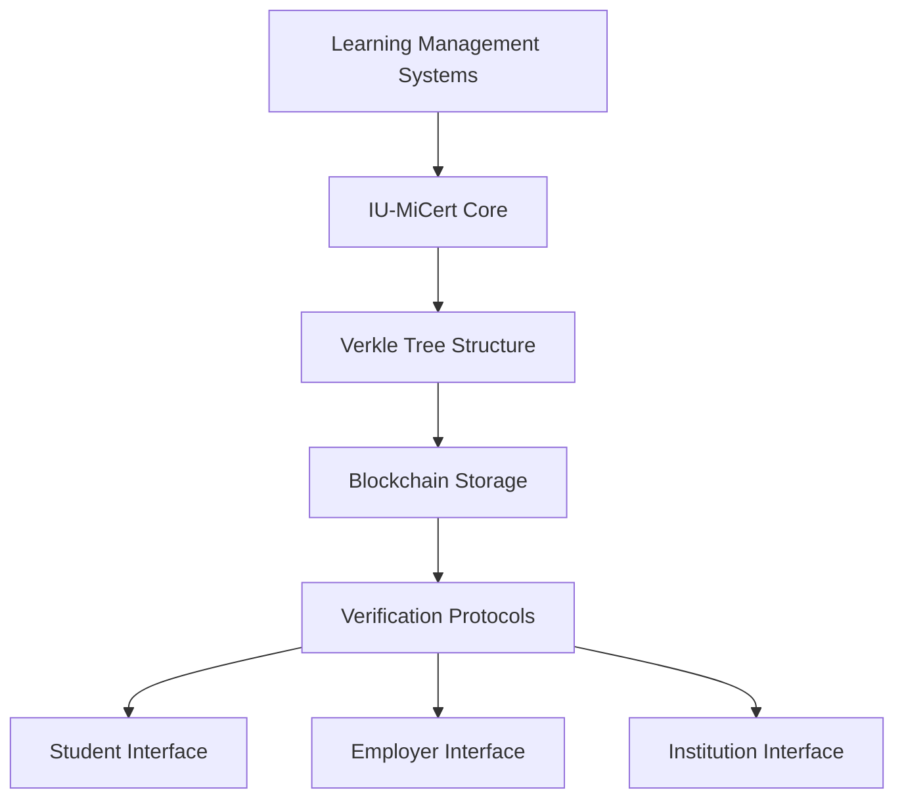

# IU-MiCert: Blockchain-Based Verifiable Academic Micro-Credential Provenance System

[](https://opensource.org/licenses/MIT)
[](https://ethereum.org/)
[](#)
[](#)

> **Enhancing credential verification through verifiable academic micro-credential provenance using Verkle trees**

## 📖 Overview

IU-MiCert is a blockchain-based system designed to address critical limitations in current academic credential verification by implementing verifiable micro-credential provenance. The system leverages **Verkle tree technology** as an improvement over traditional Merkle trees to provide:

- 🛡️ Enhanced anti-forgery mechanisms through temporal verification
- 📈 Efficient storage and verification of granular learning achievements
- 🔗 Seamless integration with existing credential management systems
- ⏳ Comprehensive audit trail of learning achievements with verifiable timestamps

## 🎯 Motivation

Traditional credential systems treat courses as isolated achievements without preserving the temporal context of a student's learning journey. IU-MiCert addresses this by:

- Treating individual courses as verifiable micro-credentials
- Enabling term-by-term verification of academic progress
- Maintaining a complete, tamper-proof academic provenance timeline
- Preventing backdating and timeline manipulation of achievements
- Supporting selective disclosure while preserving cryptographic integrity

## 🔍 Problem Statement

Current blockchain credential systems:

- Focus primarily on whole degree verification
- Lack efficient mechanisms for micro-credential management
- Create opportunities for credential forgery through timeline gaps
- Use Merkle trees that become inefficient at scale

IU-MiCert implements **Verkle tree structures** to address these challenges while maintaining compatibility with existing systems.

## 🏗️ System Architecture



### Key Components:

- **Verkle Tree Manager**: Efficient storage/verification of micro-credentials
- **Smart Contracts**: Automated credential issuance with term-based cycles
- **Commitment Engine**: Minimizes on-chain storage while maintaining provenance
- **Verification Protocols**: Efficient proof validation at scale

## 🚀 Key Features

| Feature                    | Benefit                                            |
| -------------------------- | -------------------------------------------------- |
| Verkle Tree Implementation | Compact proofs with efficient verification         |
| Term-by-Term Verification  | Verify specific academic periods independently     |
| Academic Provenance        | Complete, tamper-proof timeline of achievements    |
| Micro-Credential Tracking  | Each course becomes an independently verifiable credential |
| Selective Disclosure       | Share specific achievements without revealing full transcript |
| Temporal Integrity         | Prevents backdating and timeline manipulation       |

## 📚 Thesis Chapters

1. **Introduction**: Motivation, problem statement, and objectives
2. **Literature Review**: Blockchain credentials, Verkle trees, academic provenance
3. **System Design**: Architecture, data structures, and protocols
4. **Implementation**: Smart contracts, Verkle tree manager, interfaces
5. **Evaluation**: Security analysis, performance benchmarks, case studies
6. **Conclusion**: Findings and future work

## 🛠️ Technical Stack

- **Blockchain**: Ethereum (with potential for other EVM chains)
- **Smart Contracts**: Solidity
- **Cryptography**: Verkle tree implementation using established libraries
- **Frontend**: Next.js with React (for demo interfaces)
- **Backend**: Node.js (for institutional integration)
- **Styling**: Tailwind CSS

## 📂 Repository Structure

```
iumicert/
├── packages/
│   ├── issuer/                  # Issuer System (Go + CLI + REST API)
│   │   ├── cmd/                 # CLI commands & API server
│   │   ├── crypto/verkle/       # Verkle tree implementation
│   │   ├── data/                # Academic data & test generation
│   │   ├── publish_ready/       # Receipts, roots, blockchain records
│   │   └── web/iumicert-issuer/ # Admin dashboard (Next.js)
│   ├── client/                  # Verification Portal (Next.js)
│   │   └── iumicert-client/     # Public verification interface
│   └── contracts/               # Smart contracts (Solidity + Foundry)
├── docs/                        # Technical documentation
└── README.md                    # This file
```

## 🔬 Evaluation Metrics

- **Security**: Resistance to credential forgery attempts
- **Performance**: Proof generation/verification times vs Merkle trees
- **Storage Efficiency**: On-chain footprint comparison
- **Usability**: Stakeholder feedback on interfaces

## 📜 License

This project is licensed under the MIT License - see the [LICENSE](LICENSE) file for details.

## 📝 Citation

If you use this work in your research, please cite:

```bibtex
@thesis{phat2026iumicert,
  title={IU-MiCert: Blockchain-Based Verifiable Academic Micro-Credential Provenance System},
  author={Le Tien Phat},
  year={2026},
  institution={International University - Vietnam National University HCM},
  type={Bachelor's Thesis}
}
```

## 🌐 Live Demo & Deployed Contracts

**Ethereum Sepolia Testnet:**
- **IUMiCertRegistry**: [`0x4bE58F5EaFDa3b09BA87c2F5Eb17a23c37C0dD60`](https://sepolia.etherscan.io/address/0x4bE58F5EaFDa3b09BA87c2F5Eb17a23c37C0dD60)
- **ReceiptRevocationRegistry**: [`0x8814ae511d54Dc10C088143d86110B9036B3aa92`](https://sepolia.etherscan.io/address/0x8814ae511d54Dc10C088143d86110B9036B3aa92)

**Web Applications:**
- **Student/Verifier Portal**: [https://iu-micert.vercel.app](https://iu-micert.vercel.app)
- **Issuer Dashboard**: [https://iumicert-issuer.vercel.app](https://iumicert-issuer.vercel.app)

## ✉️ Contact

For questions about this research, please contact:

**Le Tien Phat**
📧 ltphat.developer@gmail.com
🏫 International University - Vietnam National University HCM
